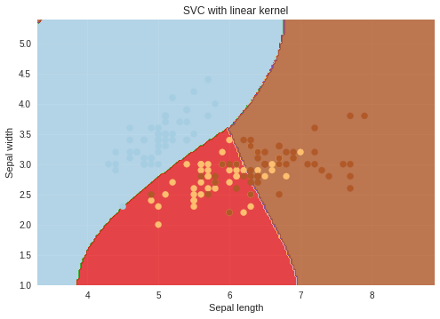

# Support Vector Machine Classification on Iris Dataset

## Project Overview
Implementation of Support Vector Machine (SVM) classification with comprehensive visualization of decision boundaries and support vector identification. Demonstrates expertise in kernel methods, hyperparameter tuning, and advanced visualization for understanding classifier behavior. Includes comparison of linear and RBF kernels with detailed decision region analysis.

## Dataset Description
- **Source**: Iris Dataset (UCI Machine Learning Repository)
- **Samples**: 150 flower observations
- **Features**: 4 numerical measurements
  - Sepal length
  - Sepal width
  - Petal length
  - Petal width
- **Classes**: 3 iris species (Setosa, Versicolor, Virginica)
- **Usage**: Classification with feature subset selection

## Methodology

### Feature Engineering
- **Feature Selection**: 2-feature subsets for visualization
- **Dimensionality Reduction**: Selection for 2D boundary plotting
- **Feature Scaling**: Implicit in SVM formulation
- **Feature Combinations**: Exploring different feature pairs
- **Domain Knowledge**: Biologically meaningful feature selection

### SVM Configuration

#### Linear Kernel
- **Kernel Type**: Linear (dot product)
- **Decision Function**: Linear hyperplane in feature space
- **Use Case**: Linearly separable problems
- **Complexity**: Lower computational cost
- **Interpretability**: Direct feature importance

#### RBF (Radial Basis Function) Kernel
- **Kernel Type**: Gaussian RBF
- **Decision Function**: Non-linear decision boundaries
- **Use Case**: Non-linearly separable problems
- **Complexity**: Higher computational cost
- **Flexibility**: More expressive capacity

### Hyperparameter Tuning
- **C Parameter**: Regularization strength
  - Controls training error vs. generalization
  - Larger C: more training emphasis
  - Smaller C: more regularization
  
- **Gamma Parameter** (RBF only):
  - Influence of single training example
  - Larger gamma: more localized influence
  - Smaller gamma: more global influence

- **Grid Search**: Systematic hyperparameter exploration

### Decision Boundary Visualization
- **Mesh Grid Creation**: Fine-grained point sampling
- **Contour Plotting**: Decision boundary visualization
- **Support Vectors**: Visualization of critical examples
- **Decision Regions**: Color-coded classification regions
- **Training Points**: Original data overlaid on boundaries

## Technical Skills Demonstrated
- **Kernel Methods**: Understanding SVM kernel theory
- **Classification**: Binary and multi-class problems
- **Hyperparameter Optimization**: Tuning for performance
- **Visualization**: Complex decision boundary plotting
- **Scikit-learn**: Advanced classifier usage
- **Mathematical Understanding**: SVM optimization objectives
- **Performance Analysis**: Decision region interpretation
- **Model Interpretation**: Understanding classifier decisions

## Visualization Techniques

### Contour Plot Generation
```python
1. Create mesh grid over feature space
2. Predict class for each mesh point
3. Plot contours of decision regions
4. Color-code regions by predicted class
5. Overlay training points
6. Mark support vectors
```

### Support Vector Identification
- **Support Vectors**: Examples on decision boundary
- **Distance to Boundary**: Margin calculation
- **Influence**: Which points maintain decision boundary
- **Visual Distinction**: Highlighted in plots
- **Analysis**: Understanding model complexity

## Results and Interpretation

### Linear Kernel Results
- **Accuracy**: Good for moderately separable classes
- **Simplicity**: Clear linear decision boundaries
- **Interpretability**: Easy to understand decisions
- **Generalization**: May underfitting on complex data

### RBF Kernel Results
- **Accuracy**: Better on non-linear problems
- **Complexity**: Complex curved boundaries
- **Overfitting Risk**: Higher with small gamma
- **Flexibility**: Handles intricate patterns

### Comparative Analysis
- **Boundary Complexity**: RBF more complex
- **Margin Width**: Geometric interpretation
- **Support Vector Count**: RBF typically more
- **Generalization**: Dataset-dependent

## Code Components
- Dataset loading and exploration
- Feature selection and preparation
- SVM classifier training
- Hyperparameter tuning
- Decision boundary plotting
- Support vector identification
- Comparison visualization
- Performance metrics

## Libraries and Tools
- **scikit-learn**: SVM implementation and evaluation
- **NumPy**: Numerical operations and mesh generation
- **Matplotlib**: 2D visualization and contour plotting
- **Pandas**: Data handling and exploration

## Mathematical Foundations

### SVM Optimization
- **Objective**: Maximize margin while minimizing errors
- **Soft Margin**: Allow some misclassifications
- **Kernel Trick**: Implicit high-dimensional mapping
- **Dual Formulation**: Computational efficiency

### Kernel Functions
- **Linear**: $K(x_i, x_j) = x_i \cdot x_j$
- **RBF**: $K(x_i, x_j) = exp(-\gamma ||x_i - x_j||^2)$
- **Polynomial**: $K(x_i, x_j) = (\gamma x_i \cdot x_j + r)^d$

## Applications and Use Cases
- **Pattern Recognition**: Classification of structured data
- **Feature Analysis**: Understanding feature importance
- **Educational Tool**: Learning classifier behavior
- **Baseline Model**: Comparison for more complex models
- **Non-linear Problems**: Demonstrating kernel methods
- **Real-world Classification**: Customer segmentation, diagnosis, etc.

## Key Insights
- **Kernel Selection**: Critical for problem-dependent performance
- **Decision Boundaries**: Visual understanding of classifier logic
- **Margin Concept**: Geometric interpretation of SVM
- **Support Vectors**: Efficiency and interpretability
- **Hyperparameter Impact**: Significant on final model

## Extensions
- **Multi-class SVM**: One-vs-One or One-vs-All strategies
- **Feature Importance**: Analyzing SVM weights
- **Probability Estimation**: Converting SVM scores to probabilities
- **Kernel Visualization**: Understanding kernel similarity
- **Cross-validation**: Robust performance estimation

## Results and Visualizations

### Decision Boundary Visualization


*Decision boundaries demonstrating kernel-based classification of iris species with support vectors marked. The visualization shows how both linear and RBF kernels separate the three iris classes, with the non-linear RBF kernel capturing more complex decision regions compared to the linear approach.*

This project demonstrates solid understanding of kernel methods and classification algorithms essential for machine learning practitioners.
