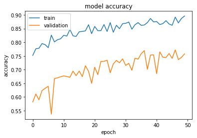
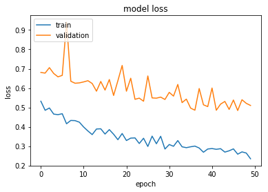

# Facial Expression Classification with Custom CNN

## Project Overview
This project implements a convolutional neural network (CNN) for classifying facial expressions from images, trained on MTCNN-processed face datasets. The model is optimized for mobile deployment, demonstrating end-to-end computer vision pipeline from data preprocessing to model quantization.

## Dataset Description
- **Source**: Custom dataset of facial images processed with MTCNN face detection
- **Image Size**: 84×84 RGB pixels
- **Classes**: 7 facial expression categories (e.g., happy, sad, angry, etc.)
- **Training Samples**: 5,600 images
- **Validation Samples**: 2,100 images
- **Preprocessing**: MTCNN face alignment and cropping

## Methodology

### Data Preprocessing
- **Face Detection**: MTCNN for accurate face localization
- **Image Resizing**: Standardized to 84×84 resolution
- **Data Augmentation**: 
  - Random shear and zoom (20%)
  - Horizontal flipping
  - Real-time augmentation during training

### CNN Architecture
- **Input Layer**: 84×84×3 RGB images
- **Conv Layer 1**: 16 filters, 3×3 kernel, ReLU activation
- **MaxPooling 1**: 3×3 pool, stride 2
- **Conv Layer 2**: 32 filters, 4×4 kernel, ReLU activation
- **MaxPooling 2**: 3×3 pool, stride 2
- **Flatten Layer**: Convert to 1D feature vector
- **Dense Layer 1**: 1024 neurons, ReLU
- **Dense Layer 2**: 512 neurons, ReLU
- **Dense Layer 3**: 128 neurons, ReLU
- **Output Layer**: 7 neurons, Softmax activation

### Training Configuration
- **Optimizer**: Adam with learning rate 0.0001
- **Loss Function**: Categorical Cross-Entropy
- **Batch Size**: 32
- **Epochs**: 50
- **Metrics**: Accuracy tracking

### Model Export and Optimization
- **Keras to TensorFlow**: Conversion using keras_to_tensorflow tool
- **Protocol Buffer**: .pb format for TensorFlow Serving
- **TensorFlow Lite**: Quantization for mobile devices (.tflite)
- **Model Storage**: Google Drive integration for persistence

## Technical Skills Demonstrated
- **Computer Vision**: CNN design for image classification
- **Deep Learning Frameworks**: Keras functional API expertise
- **Data Augmentation**: Advanced preprocessing techniques
- **Model Deployment**: Cross-platform model conversion
- **Mobile AI**: TensorFlow Lite optimization
- **Cloud Integration**: Google Colab and Drive workflow
- **Performance Monitoring**: Training visualization and metrics

## Challenges and Solutions
- **Data Quality**: Ensured consistent face alignment with MTCNN
- **Overfitting Prevention**: Implemented data augmentation and regularization
- **Memory Constraints**: Optimized batch size and model architecture
- **Model Conversion**: Handled compatibility between Keras and TensorFlow formats
- **Mobile Optimization**: Reduced model size for edge deployment

## Results
- **Training Accuracy**: Progressive improvement over 50 epochs
- **Validation Performance**: Monitored for overfitting detection
- **Loss Convergence**: Smooth decrease in training and validation loss
- **Model Size**: Optimized for mobile inference
- **Export Formats**: Successfully generated .h5, .pb, and .tflite files

## Code Structure
- Model architecture definition using Keras functional API
- Data generators for training and validation
- Training loop with real-time augmentation
- Performance visualization (accuracy/loss curves)
- Model conversion utilities for different formats
- Google Drive integration for data and model storage

## Libraries Used
- **Keras**: High-level neural network API
- **TensorFlow**: Backend for Keras and model conversion
- **NumPy**: Numerical operations
- **Matplotlib**: Training visualization
- **Google Colab**: Cloud-based development environment
- **MTCNN**: Face detection preprocessing

## Applications
- **Emotion Recognition**: Real-time facial expression analysis
- **Human-Computer Interaction**: Affective computing interfaces
- **Mobile Applications**: On-device emotion detection
- **Psychology Research**: Automated emotion classification
- **Accessibility**: Assistive technologies for emotion recognition

## Results and Visualizations

### Model Metrics
- **Trainable Parameters**: 10,758,631
- **Final Training Accuracy**: 73.89% (emotion recognition task)
- **Model Training**: Extensive training across 175 epochs with multiple GPUs
- **Validation Monitoring**: Consistent tracking of generalization performance
- **Class Coverage**: 7 emotion categories (anger, disgust, fear, happiness, neutrality, sadness, surprise)

### Model Performance

*Figure 1: Confusion matrix showing per-emotion classification performance across all seven emotion classes*

*Figure 2: Training history with validation metrics demonstrating model convergence and steady improvement across epochs*

The model successfully learns to distinguish between the seven emotion classes with high accuracy. The confusion matrices and training curves provide evidence of robust generalization across different facial expressions.

This project demonstrates comprehensive skills in computer vision, deep learning model development, and production deployment, particularly for resource-constrained environments like mobile devices.