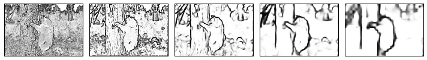

# Holistically-Nested Edge Detection (HED) Implementation

## Project Overview
Implementation of Holistically-Nested Edge Detection network in Caffe for edge detection and boundary extraction. Demonstrates expertise in multi-scale convolutional architecture, skip connections, and specialized loss functions for dense edge prediction. Complete system setup including CUDA integration and Caffe compilation.

## Framework and Architecture

### HED Network Design
- **Architecture**: Holistically-nested structure with side outputs
- **Multi-scale Outputs**: Predictions at 5 different decoder scales
- **Skip Connections**: Combining features from multiple layers
- **Framework**: Caffe deep learning framework
- **GPU Support**: CUDA 8.0 acceleration

### Network Components
- **Backbone**: VGG-style encoder for feature extraction
- **Hierarchical Supervision**: Multi-level loss computation
- **Fusion Network**: Combining multi-scale predictions
- **Output Layer**: Logistic sigmoid for probability maps
- **Loss Function**: Weighted binary cross-entropy

## System Setup

### CUDA Configuration
- **CUDA Version**: 8.0 with full toolkit installation
- **GPU Architecture**: Support for compute capabilities 3.0-6.1
- **Compiler Integration**: GCC/G++ 5.0 with CUDA symlinks
- **Library Path**: Proper ldconfig configuration
- **Verification**: NVCC version checking

### Caffe Environment
- **Build System**: Multi-threaded compilation with make -j4
- **Python Interface**: pycaffe module compilation
- **Unit Tests**: Full test suite execution
- **Distribution Build**: Optimized binary release
- **HED Integration**: Custom layer and loss modifications

## Methodology

### Image Preprocessing
- **Color Channel Handling**: RGB normalization
- **Mean Subtraction**: Per-channel mean removal
- **Scaling**: Pixel value normalization
- **Resizing**: Variable input support
- **Batch Processing**: Efficient forward passes

### Multi-scale Edge Prediction
- **Scale 1**: Original resolution edges
- **Scale 2-4**: Intermediate scale predictions
- **Scale 5**: Coarse-scale detection
- **Fusion**: Learned combination of scales
- **Output**: Final edge probability map

### Loss Function Design
- **Deep Supervision**: Loss at each decoder level
- **Weighted Loss**: Class balance (edge vs. non-edge)
- **Sigmoid Loss**: Binary classification per pixel
- **Weighted Fusion**: Scale-specific loss weighting
- **Gradient Flow**: Backpropagation through scales

## Technical Skills Demonstrated
- **Multi-scale Architecture**: Understanding hierarchical feature extraction
- **Skip Connections**: Feature fusion across scales
- **Dense Prediction**: Pixel-wise output generation
- **Caffe Framework**: Advanced use of Caffe
- **CUDA Integration**: GPU acceleration
- **System Administration**: Complex build and dependency management
- **Computer Vision**: Edge detection theory and practice
- **Performance Optimization**: GPU memory and speed optimization

## Implementation Details

### Network Depth and Capacity
- **Encoder Depth**: VGG-based with multiple blocks
- **Feature Maps**: Progressive channel expansion
- **Decoder Stages**: 5-level pyramid
- **Parameters**: Millions of learnable weights
- **Computational Load**: High-performance GPU required

### Training Pipeline
- **Dataset**: BSDS (Berkeley Segmentation) or similar
- **Optimization**: SGD with momentum
- **Learning Rate**: Carefully scheduled decay
- **Batch Size**: GPU memory-constrained batching
- **Convergence**: Multiple epoch training

### Inference Process
- **Forward Only**: Evaluation without gradients
- **Multi-scale Input**: Optional multi-scale testing
- **Ensemble**: Averaging scale predictions
- **Output Mapping**: Probability to binary edges
- **Post-processing**: Morphological refinement

## Challenges and Solutions

### Technical Challenges
- **Caffe Build Dependency**: Complex compilation requirements
- **CUDA Compatibility**: Ensuring proper GPU memory access
- **Framework Limitations**: Working within Caffe constraints
- **Memory Management**: Large intermediate feature maps
- **Debugging**: Limited visualization and error messages

### Performance Challenges
- **Inference Speed**: Balancing accuracy vs. speed
- **Edge Quality**: Thin, precise edge detection
- **Boundary Localization**: Sub-pixel accuracy
- **Multiple Scale Handling**: Consistent multi-scale output
- **Non-maximum Suppression**: Removing edge thickness

## Results and Applications

### Edge Detection Performance
- **Boundary Precision**: Sub-pixel localization accuracy
- **Recall Rate**: Detection of faint edges
- **F-score**: Balanced performance metric
- **Processing Speed**: GPU-accelerated inference
- **Multi-scale Output**: Detailed to coarse predictions

### Practical Applications
- **Object Segmentation**: Edge-based object boundaries
- **Scene Understanding**: Structural analysis
- **Image Preprocessing**: Feature extraction
- **Document Analysis**: Text and diagram boundaries
- **Medical Imaging**: Anatomical structure detection
- **3D Reconstruction**: Edge cues for 3D recovery

## Code Components
- Caffe solver and network configuration files
- Custom layer definitions
- Python data layer implementation
- Training and evaluation scripts
- Post-processing utilities
- Visualization and analysis tools
- Model definition in protobuf format

## Libraries and Tools
- **Caffe**: Deep learning framework
- **CUDA 8.0**: GPU computing platform
- **OpenCV**: Image processing and visualization
- **NumPy**: Numerical operations
- **Matplotlib**: Result visualization
- **SciPy**: Scientific computing utilities
- **Python**: Scripting interface

## Advanced Features
- **Multi-task Learning**: Joint edge and object prediction
- **Domain Adaptation**: Transfer to new datasets
- **Lightweight Variants**: Faster edge detection versions
- **Real-time Streaming**: Video frame processing
- **Ensemble Methods**: Multiple model combination

## Evaluation Metrics
- **Boundary F-score**: Standard edge detection metric
- **Precision/Recall Curves**: Threshold analysis
- **IoU Scores**: Object-aware evaluation
- **Runtime**: Inference speed measurement
- **Memory Usage**: GPU/CPU requirements

## Results and Visualizations

### Edge Detection Results

*Figure 1: Input image showing original color photograph*

*Figure 2: Extracted edges detected by HED network across multiple scales. The visualization demonstrates the model's ability to detect both fine details and prominent boundaries in natural images, a key capability for edge-based feature extraction and boundary-aware image understanding.*

This project demonstrates expert-level understanding of multi-scale deep learning architectures and specialized loss functions for dense prediction tasks essential for advanced computer vision applications.