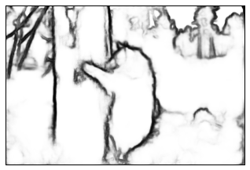

# HED Edge Detection Tutorial on BSDS Dataset

## Project Overview
Practical tutorial implementation of Holistically-Nested Edge Detection (HED) applied to the Berkeley Segmentation Dataset (BSDS). Demonstrates complete pipeline from model initialization to result visualization, showcasing expertise in applying pre-trained edge detection models to real-world datasets.

## Dataset Description

### BSDS (Berkeley Segmentation Dataset)
- **Source**: UC Berkeley Computer Vision group
- **Purpose**: Edge detection and boundary segmentation evaluation
- **Content**: Natural images with human-annotated boundaries
- **Image Count**: Hundreds of test images
- **Characteristics**: Diverse scenes with multiple objects
- **Ground Truth**: Multiple annotators per image

## Methodology

### Environment Setup
- **Caffe Installation**: Complete Caffe framework setup
- **Python Path Configuration**: Proper module import paths
- **GPU Mode Enablement**: CUDA acceleration activation
- **Library Loading**: All necessary dependencies
- **Model Verification**: Testing environment validity

### Image Loading and Preprocessing
- **Image Reading**: OpenCV or PIL loading
- **Color Channel Handling**: RGB format conversion
- **Normalization**: Per-image or global normalization
- **Mean Subtraction**: VGG mean value removal
- **Resizing**: Optional scaling for inference
- **Batch Preparation**: Single or batch processing

### Model Initialization
- **Model Architecture**: Loading HED network definition (.prototxt)
- **Pre-trained Weights**: HED model weights (.caffemodel)
- **Network Instantiation**: Caffe net object creation
- **GPU/CPU Mode**: Device selection for inference
- **Input Blob Configuration**: Setting input data layer

### Forward Pass Inference
- **Data Blob Setup**: Populating network input
- **Forward Computation**: Single forward pass
- **Memory Management**: Efficient tensor allocation
- **Multi-scale Processing**: Predictions at different scales
- **Output Extraction**: Accessing prediction tensors

### Multi-scale Fusion
- **Scale Extraction**: Getting predictions from 5 decoder levels
  - Scale 1: Full resolution
  - Scale 2: 0.5x resolution
  - Scale 3: 0.25x resolution
  - Scale 4: 0.125x resolution
  - Scale 5: 0.0625x resolution
  
- **Upsampling**: Resizing to original resolution
- **Weighted Fusion**: Combining scales with learned weights
- **Final Output**: Fused edge probability map
- **Sigmoid Mapping**: Converting to 0-1 probabilities

### Results Visualization
- **Image Display**: Original image showcase
- **Edge Map Visualization**: Predicted edge map
- **Difference Visualization**: Predicted vs. ground truth
- **Color Mapping**: Heatmap visualization
- **Overlay Display**: Edge overlay on original image

## Technical Skills Demonstrated
- **Pre-trained Model Usage**: Leveraging existing models
- **Caffe Inference**: Network forward pass execution
- **GPU Computing**: CUDA-enabled deep learning
- **Image Processing**: Multi-format image handling
- **Multi-scale Processing**: Pyramid-based inference
- **Data Visualization**: Result presentation
- **Dataset Integration**: Working with standard datasets
- **Performance Analysis**: Inference evaluation

## Implementation Details

### Code Structure
```python
1. Import Caffe and necessary libraries
2. Load image from BSDS dataset
3. Set Caffe device to GPU
4. Load HED model architecture and weights
5. Prepare input blob with preprocessed image
6. Perform forward pass
7. Extract multi-scale outputs
8. Upsample to original resolution
9. Fuse predictions
10. Visualize results
```

### Key Caffe API Usage
- `caffe.Net()`: Network instantiation
- `net.blobs`: Accessing intermediate outputs
- `net.params`: Accessing network weights
- `net.forward()`: Forward pass execution
- `set_mode_gpu()`: GPU acceleration

### Data Flow
- Image (H×W×3) → Preprocessing → (1×3×H×W) tensor
- Forward pass through HED encoder
- Multi-scale decoder outputs
- Upsampling to H×W
- Sigmoid non-linearity
- Edge probability map

## Challenges and Solutions

### Technical Challenges
- **Caffe Path Configuration**: Proper module import
- **GPU Memory**: Managing large feature maps
- **Multiple Scales**: Handling different resolutions
- **Data Type Precision**: Float32 operations
- **Batch Dimension**: Single image vs. batch processing

### Practical Challenges
- **Pre-trained Weights**: Finding compatible models
- **Color Channel Order**: BGR vs. RGB conversion
- **Normalization Constants**: Correct mean subtraction values
- **Output Interpretation**: Understanding probability maps
- **Evaluation**: Comparing with ground truth

## Results and Evaluation

### Edge Detection Quality
- **Boundary Precision**: Sub-pixel edge localization
- **Recall Rate**: Detection of all boundaries
- **F-measure**: Balanced precision-recall metric
- **Visual Quality**: Perceptual edge quality
- **Consistency**: Frame-to-frame stability

### Performance Metrics
- **Processing Time**: Latency per image
- **Memory Usage**: GPU/CPU requirement
- **Throughput**: Images per second
- **Scalability**: Varying image sizes

## Applications and Use Cases
- **Segmentation Preprocessing**: Edge-based object segmentation
- **Object Detection**: Edge cues for detection
- **Image Editing**: Boundary-aware tools
- **Scene Understanding**: Structural analysis
- **3D Reconstruction**: Edge-based depth estimation
- **Document Analysis**: Text boundary detection
- **Medical Imaging**: Organ boundary detection

## Code Components
- Image loading and preprocessing functions
- Caffe network initialization
- Forward pass wrapper functions
- Multi-scale fusion utilities
- Visualization functions
- Batch processing pipeline
- Evaluation metrics computation

## Libraries and Tools
- **Caffe**: Deep learning framework
- **NumPy**: Array operations
- **OpenCV**: Image loading and processing
- **Matplotlib**: Visualization
- **SciPy**: Scientific utilities
- **Pillow**: Image format support

## Performance Characteristics
- **Input Flexibility**: Variable image sizes
- **Memory Efficient**: Optimized tensor allocation
- **GPU Accelerated**: Real-time on modern GPUs
- **Robust**: Handles diverse image content
- **Generalizable**: Works across datasets

## Extensions and Advanced Topics
- **Batch Processing**: Processing multiple images
- **Video Processing**: Frame-by-frame edge detection
- **Averaging**: Temporal smoothing
- **Ensemble Methods**: Combining with other detectors
- **Real-time Application**: Streaming edge detection
- **Custom Fine-tuning**: Adapting to specific domains

## Results and Visualizations

### Edge Detection Results


*Figure 1: Input image from Berkeley Segmentation Dataset showing natural scene*


*Figure 2: Edge detection results from HED model, demonstrating the network's ability to extract meaningful boundaries and contours from the input image*

This tutorial demonstrates practical expertise in deploying and using state-of-the-art deep learning models for edge detection tasks, essential for computer vision applications.