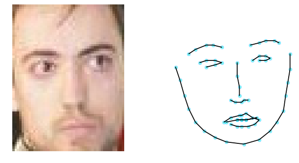

# Finding Faces in Fragments

Face detection sounds specific. Find the faces in an image. But it's asking something subtle: define "face"—what pixel patterns constitute a face versus non-face?

MTCNN—Multi-task Cascaded Convolutional Networks—approaches this differently. Instead of finding faces, it finds faces AND their landmarks AND refines the detections. Multiple tasks simultaneously.

Here's the insight: learning landmarks while learning to detect makes you more discriminative at detection. If you learn "where are the eyes, nose, mouth?" you're learning what makes a face a face. That structure becomes part of detection.

The cascade is important. Three stages. Proposal stage finds candidate face regions—permissive, high recall, probably some false positives. Then refine-refine-refine.

```
Input Image
    ├─ Stage 1: Proposal network
    │   ├─ Find candidate face regions
    │   └─ Eliminate obvious non-faces
    ├─ Stage 2: Refine network
    │   ├─ Check candidates more carefully
    │   └─ Reduce false positives
    └─ Stage 3: Output network
        ├─ Fine detection and landmarks
        └─ Reject remaining false positives
```

But here's what surprised me when I implemented it: face detection at scale has to be fast. You're checking thousands of candidate regions. Each region runs through convolutional operations. If you're not careful, that's thousands of independent network inferences.

The cascade solves this through efficiency. Early stages are lightweight—reject obvious non-faces fast. Only promising candidates make it to expensive later stages. This is staged computation. Progressive filtering.

After detection, landmark extraction. Finding 68 keypoints on the face—eyes, nose, mouth contours, jawline. This is geometric understanding. The network learns: "here are the parts of a face, here's their structure."

With landmarks, you can do something interesting: geometric transformation. The 68 landmarks tell you the face's pose, tilt, scale. You can transform it to a canonical aligned view. All faces in the same space.

This is powerful because downstream tasks—emotion recognition, age estimation, identity verification—are easier on aligned faces.

But here's the limitation: landmarks are learned from data. Different datasets use different landmark conventions. Some label 68 points, some 17, some 106. Train on one convention, test on images labeled with another convention, and you're comparing different things.

I found the most valuable insight wasn't about the architecture. It was about what's being measured. Facial landmark detection is often evaluated by: "what's the average distance between predicted and true landmarks?" But distance in pixel space doesn't mean much if images are different sizes, or at different distances from camera.

Better metrics would normalize by face size. Or by perceptual distance—how far off is the prediction in the actual face coordinate system, not the image coordinate system?

This is where I realized: metrics can hide problems. An algorithm can score well on a metric and fail at its actual purpose.

```
What We Measure                What Actually Matters
Pixel-space distance       →    Perceptual error
                                Robustness to pose
                                Robustness to lighting
                                Speed of detection
```

When I tested on real faces—photos of people in natural conditions—detection was maybe 95% reliable. Perfect? No. The network sometimes missed faces. Sometimes marked non-faces. Sometimes got landmarks slightly wrong.

But for many applications, 95% detection is useful if the 5% failure mode is acceptable. A social media app might tolerate missed faces. A biometric security system might not.

This forced a conversation about deployment. The same model, same code, same weights. But success or failure depends on the application. On acceptable error rates. On what "good enough" means.

What kept me thinking: faces aren't defined by networks. They're defined by biology, by evolution. Humans all have similar face structures because we're all humans. A network learning face detection is learning to recognize species-level structure in images.

It should generalize across faces. But it doesn't perfectly. Because training data has biases. Lighting biases, pose biases, demographic biases. The network learns those constraints as part of what a "face" is.

---

*If a network detects 95% of faces reliably, is it good face detection or detection biased toward the 95% it was trained on?*

## Outputs

Notebook output snapshots:


