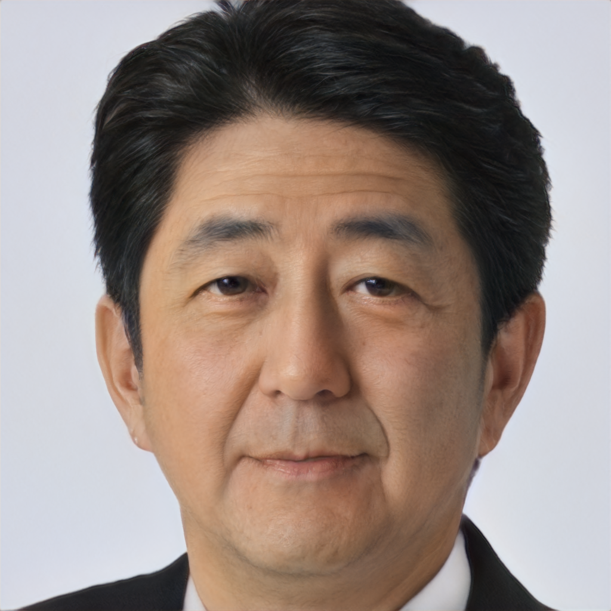

# Turning Faces Into Cartoons Into Meaning

There's something unsettling about watching a photo of yourself transform into stylized art. Your features preserved, but in a different aesthetic. You're recognizable but not realistic.

StyleGAN2 makes this possible. A generative model trained to synthesize faces. Feed it a latent code—a vector in learned feature space—and it generates a face.

The trick: the generator learns to produce faces so realistic that it fools a discriminator. The discriminator learns to distinguish real from generated. They compete until both are excellent.

But StyleGAN2 adds something crucial: style mixing. Different layers of the generator control different aspects. Early layers control coarse shape. Later layers control fine features, texture, color.

By feeding different latent codes to different layers, you can separate identity from style. Keep someone's identity while changing artistic style.

```
Latent Code
    ├─ Coarse levels (early layers)
    │   └─ Controls: face shape, pose, basic structure
    ├─ Medium levels (middle layers)
    │   └─ Controls: facial features, expression
    └─ Fine levels (later layers)
        └─ Controls: texture, color, artistic nuance
    ↓
Synthesis Network (Generator)
    ↓
Generated Face (Real-looking or stylized)
```

But here's the subtle part: the generator never learned what a face is. It learned: "what patterns fool the discriminator?"

Faces are one distribution the generator learned. But it could generate many other things. Objects, scenes, textures. The training just happened to be on faces.

When you ask it to stylize a face—convert to cartoon—you're projecting it into cartoon generator's latent space. Finding the latent code that, when decoded, produces that face in cartoon style.

This projection is non-trivial. The projection network that finds matching latent codes is itself trained. And training is slow. Minutes per image.

Here's where I hit a deeper question: what does it mean to "understand" how to toonify?

The network doesn't understand art. Doesn't understand that cartoons have exaggerated features, simplified colors, reduced detail. It learned: "when I see this latent code fed to the cartoon generator, it produces images that look like cartoons to humans."

So it's learning human aesthetic preferences, embedded in training data and discriminator feedback.

This is powerful but also concerning. The network learned from internet images. Those images have biases. Aesthetic preferences embedded in cultural context. Demographics, beauty standards, accepted art styles.

The generative model learns and perpetuates those biases.

```
Training Data Distribution
    ├─ Demographics (who's in photos)
    ├─ Aesthetics (what's considered beautiful)
    ├─ Cultural standards (what's "normal" face)
    └─ Artistic style preferences
    ↓
Generator learns all of these
Including biases we might not want
```

When you use a generative model to create art, you're not creating neutrally. You're creating through learned biases.

Interesting question: is that bad? Art has always reflected cultural biases. Renaissance art reflects Renaissance aesthetics. Modern AI art reflects internet aesthetics.

The difference: we're training on data we didn't curate carefully. And we're deploying to people who don't understand it's biased.

What kept me thinking: StyleGAN2 represents a shift. Not learning features from images, but learning to generate images. Not passive analysis but creative synthesis.

This opens possibilities: generate synthetic faces for privacy, for testing, for art. But also possibilities: generate realistic fake content. Deepfake concerns.

The same technology. Different uses. Different ethics.

Toonification is benign. Fun. But it reveals a capability you could use for other purposes.

---

*If a generative model learns to transform faces by absorbing aesthetic biases from training data, are we creating art or reproducing cultural prejudices?*

## Outputs

Notebook output snapshots:


