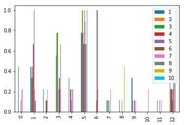
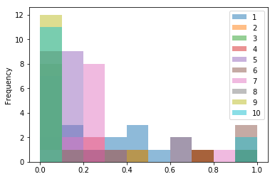
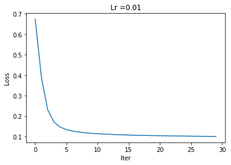

# Breast Cancer Classification Using Custom 2-Layer Neural Network

## Project Overview
This project demonstrates a complete implementation of a neural network from scratch for binary classification of breast cancer tumors using the Wisconsin Breast Cancer Dataset. The implementation showcases deep understanding of machine learning fundamentals, including neural network architecture, backpropagation, gradient descent, and evaluation metrics.

## Dataset Description
- **Source**: Wisconsin Breast Cancer Dataset (UCI Machine Learning Repository)
- **Features**: 9 real-valued features derived from digitized images of fine needle aspirates of breast masses
- **Target**: Binary classification (Benign = 0, Malignant = 1)
- **Size**: 683 samples after preprocessing
- **Split**: 500 samples for training, 183 for testing

## Methodology

### Data Preprocessing
- **Handling Missing Values**: Removed samples with missing values (marked as '?')
- **Feature Scaling**: Applied MinMaxScaler to normalize features between 0 and 1
- **Label Encoding**: Converted class labels (2→0 for benign, 4→1 for malignant)
- **Data Visualization**: Plotted feature distributions and histograms for exploratory analysis

### Neural Network Architecture
- **Input Layer**: 9 neurons (corresponding to 9 features)
- **Hidden Layer**: 15 neurons with ReLU activation
- **Output Layer**: 1 neuron with Sigmoid activation for binary classification
- **Weight Initialization**: Xavier initialization for better convergence

### Implementation Details
- **Activation Functions**: Custom implementation of Sigmoid and ReLU with their derivatives
- **Forward Propagation**: Manual computation of layer outputs
- **Loss Function**: Binary Cross-Entropy Loss
- **Backpropagation**: Complete derivation and implementation of gradients
- **Optimization**: Gradient Descent with learning rate 0.01
- **Training**: 15,000 iterations with loss tracking every 500 iterations

### Evaluation Metrics
- **Accuracy**: Overall classification accuracy
- **Confusion Matrix**: Visualization of true positives, false positives, etc.
- **Loss Curves**: Training loss convergence plot

## Technical Skills Demonstrated
- **Deep Learning Fundamentals**: Understanding of neural network components and training process
- **Mathematical Derivations**: Correct implementation of backpropagation algorithm
- **Numerical Computing**: Efficient use of NumPy for matrix operations
- **Data Science Pipeline**: End-to-end ML project from data loading to evaluation
- **Visualization**: Effective plotting of results and data exploration
- **Debugging**: Handling edge cases in gradient computations

## Challenges and Solutions
- **Gradient Computation**: Ensured correct derivative calculations for ReLU and Sigmoid
- **Numerical Stability**: Used appropriate initialization to prevent vanishing gradients
- **Hyperparameter Tuning**: Experimented with learning rates and layer sizes
- **Data Quality**: Handled missing values and ensured data integrity

## Results
- **Training Accuracy**: Achieved high accuracy on training set
- **Test Accuracy**: Evaluated performance on unseen test data
- **Loss Convergence**: Demonstrated decreasing loss over training iterations
- **Confusion Matrix**: Provided detailed breakdown of classification performance

## Code Structure
- `dlnet` class: Encapsulates the neural network functionality
- Custom activation functions and their derivatives
- Training loop with gradient descent
- Prediction and evaluation methods
- Data preprocessing pipeline

## Libraries Used
- **NumPy**: Core numerical computations and matrix operations
- **Pandas**: Data manipulation and CSV handling
- **Scikit-learn**: Data preprocessing (MinMaxScaler) and metrics
- **Matplotlib**: Visualization of loss curves and confusion matrices

## Results and Visualizations

### Training Performance

*Figure 1: Training loss demonstrating convergence during gradient descent optimization*

*Figure 2: Training accuracy progression showing model improvement over iterations*

### Evaluation Metrics

*Figure 3: Classification confusion matrix showing prediction accuracy on positive and negative cases. The matrix demonstrates the model's discriminative ability between malignant and benign tumors based on learned features.*

This project highlights expertise in implementing complex algorithms from mathematical principles, demonstrating both theoretical understanding and practical coding skills essential for machine learning engineering roles.