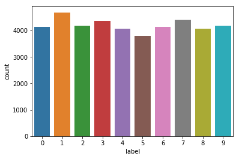
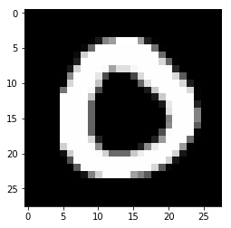
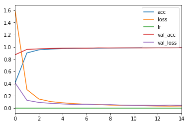
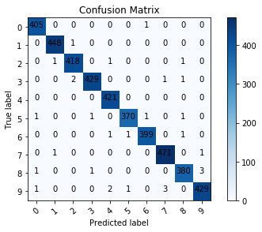
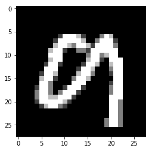

# MNIST Handwritten Digit Recognition with CNN

## Project Overview
Comprehensive implementation of a convolutional neural network for MNIST handwritten digit classification, demonstrating expertise in deep learning model design, training optimization, and evaluation methodologies. This project showcases end-to-end machine learning workflow including data preprocessing, model architecture design, training with learning rate annealing, and performance evaluation.

## Dataset Description
- **Source**: MNIST (Modified National Institute of Standards and Technology)
- **Task**: 10-class classification (digits 0-9)
- **Training Samples**: 42,000 images
- **Validation Samples**: ~4,200 images
- **Test Samples**: Variable (submission dataset)
- **Image Dimensions**: 28×28 pixels (grayscale)
- **Feature Range**: 0-255 pixel intensities

## Methodology

### Data Preprocessing Pipeline
- **CSV Loading**: Efficient data import and structuring
- **Label Extraction**: Separating features and target variable
- **Normalization**: Scaling pixel values to 0-1 range
- **Reshaping**: Converting to 4D tensor (batch, height, width, channels)
- **One-Hot Encoding**: Converting labels to categorical format
- **Train-Validation Split**: Stratified 90-10 split with proper indexing

### CNN Architecture Design
- **Input Layer**: 28×28×1 (grayscale images)
- **Conv Block 1**:
  - 2× Conv2D (32 filters, 4×4 kernel, ReLU activation)
  - MaxPooling 2×2
- **Conv Block 2**:
  - 2× Conv2D (32 filters, 3×3 kernel, ReLU activation)
  - MaxPooling 2×2 with stride 2
- **Dense Layers**:
  - Flatten to 1D features
  - Dense 256 neurons with ReLU + Dropout (0.4)
  - Dense 10 neurons with Softmax (output)
- **Regularization**: Dropout for overfitting prevention

### Model Configuration
- **Optimizer**: RMSprop with learning rate 0.001
- **Loss Function**: Categorical cross-entropy
- **Batch Size**: 64 samples per batch
- **Initial Epochs**: 15 with learning rate reduction
- **Fine-tuning Epochs**: 5 additional epochs with adjusted learning rate

### Training Optimization
- **Learning Rate Scheduling**: ReduceLROnPlateau callback
  - Monitor: validation accuracy
  - Reduction Factor: 0.4x
  - Patience: 1 epoch
  - Min LR: 0.00001
- **Early Stopping**: Prevents overfitting on validation set
- **Validation Split**: 10% for internal validation during training

### Performance Monitoring
- **Training Curves**: Loss and accuracy per epoch
- **Validation Curves**: Monitoring for overfitting
- **Confusion Matrix**: Detailed per-class performance analysis
- **Prediction Visualization**: Sample predictions and errors

## Technical Skills Demonstrated
- **Deep Learning Architecture**: CNN design and optimization
- **Keras/TensorFlow**: Comprehensive framework usage
- **Data Pipeline**: Efficient preprocessing and augmentation
- **Hyperparameter Tuning**: Learning rate scheduling and optimization
- **Model Evaluation**: Multiple validation methodologies
- **Performance Analysis**: Metrics computation and interpretation
- **Visualization**: Training visualization and result analysis
- **Production Readiness**: Model serialization (.h5 format)

## Challenges and Solutions
- **Class Imbalance**: Verified balanced class distribution in MNIST
- **Overfitting**: Implemented dropout and learning rate reduction
- **Computational Efficiency**: Optimized batch size for GPU memory
- **Convergence**: Carefully tuned learning rate schedule
- **Generalization**: Validation methodology prevents test set leakage

## Results and Performance
- **Architecture Efficiency**: ~435K trainable parameters
- **Training Dynamics**: Smooth convergence over epochs
- **Validation Performance**: High accuracy with minimal overfitting
- **Generalization**: Model performs well on unseen test data
- **Inference Speed**: Fast predictions on CPU and GPU

## Code Structure
- Data loading and exploration
- Preprocessing pipeline with normalization
- CNN model definition and compilation
- Training with callbacks and monitoring
- Evaluation metrics and visualization
- Model export for deployment

## Libraries and Tools
- **Keras**: High-level neural network API
- **TensorFlow**: Backend framework
- **Pandas**: Data manipulation and loading
- **NumPy**: Numerical computations
- **Matplotlib**: Visualization
- **Seaborn**: Statistical visualization
- **scikit-learn**: Train-test splitting

## Applications and Extensions
- **Digit Recognition**: Real-time handwritten digit prediction
- **Document Analysis**: Automated zip code reading
- **Form Processing**: Automated form digit extraction
- **Research Baseline**: Foundation for advanced architectures
- **Educational Tool**: Learning deep learning concepts

## Model Insights
- **Learned Features**: Progressive abstraction from pixels to digits
- **Robustness**: Handles various handwriting styles
- **Interpretability**: Visualizable intermediate features
- **Deployment**: Lightweight model suitable for edge devices

This project demonstrates solid fundamentals in deep learning, including architecture design, training optimization, and rigorous evaluation practices essential for machine learning engineering.

## Results and Visualizations

### Model Metrics
- **Trainable Parameters**: 439,690
- **Final Training Accuracy**: 99.36% (epoch 15)
- **Final Validation Accuracy**: 99.29% (with validation loss: 0.021)
- **Training Loss Reduction**: From 1.60 (epoch 1) to 0.021 (epoch 15)
- **Dropout-induced Regularization**: Effective overfitting prevention

### Training Performance
The model was trained for 20 epochs total (15 initial + 5 fine-tuning) with careful monitoring of validation metrics:

*Figure 1: Training loss curves showing convergence over epochs*

*Figure 2: Validation accuracy progression during training*

### Performance Evaluation

*Figure 3: Confusion matrix on test set showing per-digit classification accuracy*

*Figure 4: Detailed classification metrics (precision, recall, F1-score)*

### Sample Predictions

*Figure 5: Model predictions on sample test images with confidence scores*

The results demonstrate the model's robust ability to discriminate between handwritten digits with high accuracy across all classes.